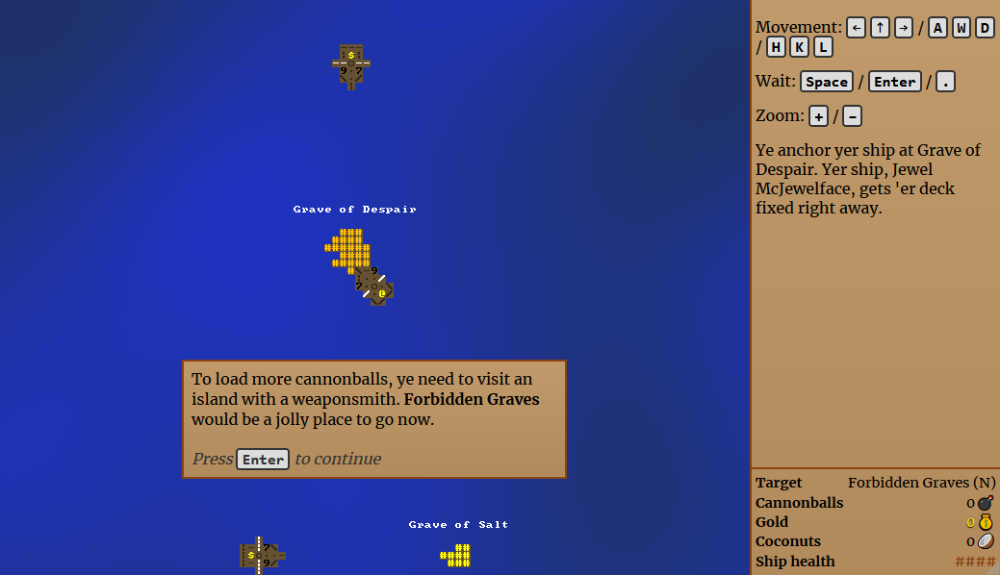

# Rogue Sea

*A 7-day rogue-like turn-based raster-tiled naval-themed keyboard-controlled typescript-authored game*

[Play it online in yer browser!](https://ondras.github.io/rogue-sea/)



## Main features

  - Sea, ships, islands, cannons, pirates
  - Zoomable map
  - Multi-tile entities
  - Three ship sizes
  - Procedurally generated sea/islands
  - WebGL rendering via [fastiles](https://github.com/ondras/fastiles)
  - Spatial audio via [PannerNode](https://developer.mozilla.org/en-US/docs/Web/API/PannerNode)
  - Control using arrows, AWD or vim-keys
  - Tutorial

## Development

```sh
git clone ...
npm i
npm run build
```
